# Terraform-Ec2-Instance-with-key-pair-and-user-data

## PROJECT TITLE
Provisioning an EC2 Server with Terraform, Auto-Generated Key Pair, and User Data — A Complete Walkthrough to a Live Apache “Hello World”

## EXECUTIVE SUMMARY
This mini build used Terraform to spin up a free-tier EC2 Linux instance (t2.micro), automatically create and save a secure SSH key pair, and bootstrap the machine with a user-data script that installs Apache and serves a simple web page. I designed the work so a true beginner could follow every step, while still applying sensible DevOps practices: variables, data sources, clear outputs, and a repeatable plan → apply → verify → destroy cycle. I documented each error I hit or could realistically hit in this exact scenario and how I resolved it. By the end, I could browse to the instance’s public IP and see the page, and I could log in via SSH using the private key Terraform produced.

## PURPOSE AND OBJECTIVES
Purpose: develop solid IaC habits by declaring a small internet-reachable server that configures itself on first boot.
Goals achieved:

1. Author a neat Terraform configuration that reliably creates one EC2 instance in a chosen region.
2. Generate an SSH key pair programmatically (no manual key creation), saving the private key locally with the right file permissions and registering the public key in AWS.
3. Use cloud-init user data to install and enable Apache (httpd) and to publish a minimal index page.
4. Expose only the required ports (HTTP open to all; SSH restricted to a CIDR I control).
5. Validate, apply, test, then tear down to avoid unnecessary cost.
6. Stretch deliverables: parameterize inputs, discover a safe Amazon Linux 2 AMI automatically, print friendly connection outputs, and add guardrails such as a .gitignore and basic security notes.

### FOUNDATION: CORE IDEAS IN PLAIN LANGUAGE
Terraform: a tool where infrastructure is described as text and then applied so the cloud matches that description.
Provider: the plug-in Terraform uses to talk to a platform. I used AWS for EC2, plus TLS (for key generation) and Local (to write files on my machine).
Resource: an object Terraform creates or manages (EC2 instance, security group, AWS key pair).
Data source: a read-only lookup; I used this to fetch the latest Amazon Linux 2 AMI instead of hard-coding IDs.
Variables: named knobs for things like region, instance type, key name, and my SSH CIDR, so I don’t edit multiple places.
User data: a first-boot script the instance runs automatically, here used to install and start Apache and drop an index.html.
State: Terraform’s record of what it built; for this exercise it stays local and is ignored by Git.

### ENVIRONMENT AND SAFETY PREP

1. I ensured I had an AWS account and created an IAM user with programmatic access. I stored the access key ID and secret safely.
2. I installed the AWS CLI and Terraform, configured the CLI with my credentials and region, and confirmed everything by asking AWS for my caller identity so I knew auth was correct.
3. I worked in a region that typically offers a default VPC and free-tier capacity (us-east-1) to minimize friction.
4. I created a dedicated folder named terraform-ec2-keypair and added a .gitignore to keep state files and any .pem keys out of version control.

### FILES I CREATED AND WHY
I kept the project to three main working files plus a .gitignore.

A. Variables file
I declared region, instance type, project name, key name, and my\_ip\_cidr. The my\_ip\_cidr default is open for learning, but the intent is to change it to my actual public IP with /32 for better security.

B. User-data script
This is a short Bash script for Amazon Linux 2 that runs once at first boot. It updates packages, installs httpd, enables it to start at boot, starts it immediately, and writes a small HTML page to /var/www/html/index.html. I kept it compact to make boot fast and reduce chances of typos that complicate troubleshooting.

C. Main Terraform configuration
I specified Terraform and provider requirements (aws, tls, local) and set the AWS provider to use the region variable.
Using a data source, I retrieved the most recent Amazon Linux 2 AMI owned by Amazon, avoiding stale, region-specific IDs.
I read the default VPC and its subnets to keep networking simple for a starter exercise.
I generated a 4096-bit RSA key via the TLS provider, registered the public key as an AWS key pair, and wrote the private key to disk with strict 0400 permissions using the Local provider so SSH would accept it.
I created a security group that permits SSH (22) from my\_ip\_cidr and HTTP (80) from anywhere, with open egress so the instance can fetch updates.
I launched the EC2 instance with the discovered AMI, the chosen size, a public IP, the security group, the key pair, and the user-data script. I tagged resources with my project name for easy identification.
I added outputs that reveal the public IP, public DNS, an exact copy-paste SSH command, and the path to the generated private key file.

### STEP-BY-STEP EXECUTION WORKFLOW

1. Initialization: inside the project directory I ran Terraform’s initialization to download providers and set up the working directory.
2. Formatting and validation: I formatted files and validated the configuration to catch structural mistakes early.
3. Plan: I requested a plan to preview the changes. I confirmed it would add an AWS key pair, write a local private key file, create a security group, and launch one EC2 instance. I also noted the AMI that was selected.
4. Apply: I proceeded to create the resources. Terraform generated the key, saved the .pem locally, created the security group, and launched the instance. When the apply finished, the outputs printed at the end gave me everything I needed.
5. Web test: I pasted the public IP into a browser. During the first minute the page can be empty as user-data runs; after a short wait the “Hello World” page appeared.
6. SSH test: I used the SSH command from the outputs. The username was ec2-user (Amazon Linux 2). I accepted the fingerprint prompt and verified httpd was running and index.html existed.
7. Destroy drill: I practiced a clean teardown so I could remove all resources once finished and avoid lingering costs.

### WHY I MADE EACH DECISION
Amazon Linux 2 choice: well supported on EC2, simple package management, and plenty of documentation; suitable for free-tier demos.
AMI via data source: eliminates brittle, hard-coded IDs and keeps the config portable across regions and time.
Default VPC and subnets: reduces complexity for a first IaC run by avoiding extra VPC plumbing.
Key generation in Terraform: proves full automation and guarantees the key saved locally matches the key AWS expects.
Strict key permissions: SSH refuses loose key files; automating 0400 avoids a frequent beginner error.
Minimal inbound rules: only port 80 to the world and port 22 restricted by CIDR keeps the exposure small while enabling required access.
Outputs: they remove guesswork, especially around the correct SSH username and where to find the IP and key.

### EVERY FAILURE I ENCOUNTERED OR COULD REALISTICALLY ENCOUNTER HERE, AND HOW I FIXED EACH

1. Missing or invalid AWS credentials
   What I saw: unauthorized or “no credentials” errors.
   Reason: CLI not configured or a typo in the credentials file.
   Resolution: I re-ran the CLI configuration and confirmed with a caller identity request before touching Terraform again.

2. AMI not present in the region
   What I saw: instance creation failed due to an invalid AMI.
   Reason: region-specific hard-coded image from elsewhere.
   Resolution: I relied on the AMI data source that selects the latest Amazon Linux 2 image owned by Amazon.

3. No default VPC
   What I saw: lookups failed or instance launches complained about networking.
   Reason: the target region didn’t have a default VPC.
   Resolution: I used us-east-1 (which had one). Alternately, I could define a VPC stack in Terraform, but that’s beyond this minimal scope.

4. SSH blocked
   What I saw: SSH stalled or refused.
   Reason: my\_ip\_cidr was wrong or my network blocked outbound port 22.
   Resolution: I set my\_ip\_cidr to my exact public IP with /32 and, if needed, tried a different network where outbound 22 is allowed.

5. Key file too permissive
   What I saw: SSH warning about key permissions and refusal to use the key.
   Reason: the file had broad permissions after a manual copy.
   Resolution: I ensured the file is created with 0400 and, if necessary, corrected it so SSH accepts it.

6. HTTP not loading immediately
   What I saw: blank or timeout in the browser right after apply.
   Reason: user-data was still installing packages on first boot.
   Resolution: I gave it a minute and then refreshed. I also checked instance status checks and verified that port 80 was allowed.

7. User-data line-ending issues
   What I saw: Apache wasn’t installed and no index.html appeared.
   Reason: CRLF line endings can break cloud-init parsing.
   Resolution: I saved the script with Unix line endings and re-applied; Apache then installed correctly.

8. Provider version conflicts
   What I saw: initialization failed to resolve versions.
   Reason: overly tight version pins compared to my Terraform version.
   Resolution: I used a compatible version range and re-initialized with an upgrade; downloads then succeeded.

9. Key name already exists
   What I saw: AWS rejected key pair creation as a duplicate.
   Reason: I had used the same key name before.
   Resolution: I picked a new key name or deleted the old key pair from AWS and applied again.

10. Instance without a public IP
    What I saw: instance reachable only privately.
    Reason: subnet settings or not explicitly associating a public IP.
    Resolution: I forced associate public IP and used a public subnet in the default VPC.

11. Slow or failing yum mirrors
    What I saw: delays or failures during package updates.
    Reason: transient repository issues.
    Resolution: I tried a fresh apply; subsequent attempts succeeded. If needed, I could switch distro and adjust the package manager commands.

12. Destroy order hiccups
    What I saw: destroy complained about resource dependencies.
    Reason: dependent resources still attached.
    Resolution: I ran destroy again and let Terraform compute the correct order; in rare cases, I removed a blocker manually and refreshed state.

### POST-DEPLOY VALIDATION

1. I opened the public IP in a browser and saw the “Hello World” page, proving the security group, user-data, and httpd were all working.
2. I connected over SSH with the generated private key, confirmed the service status, and inspected cloud-init logs for any script errors.
3. In the AWS console I verified the security group rules, tags, and resource names to ensure everything was organized and understandable.

### WORK DONE BEYOND THE BASE REQUIREMENTS

1. Exposed key settings through variables so the stack is reusable and easy to tune.
2. Used an AMI data source to avoid stale IDs and increase portability.
3. Produced helpful outputs to minimize guesswork during testing.
4. Automated key generation and enforced strict permissions for a smoother SSH experience.
5. Added a .gitignore to keep secrets and state out of source control.
6. Wrote a troubleshooting section tailored to the exact failure modes of this setup so another learner can self-serve fixes.

### COST CONTROL AND CLEANUP
I used a free-tier size and removed everything as soon as I finished testing. The destroy operation removed the instance, the security group, and the AWS key pair. I deleted the leftover .pem file on my machine since Terraform doesn’t remove local files it created.

### SECURITY NOTES I CAPTURED

1. Don’t commit state or keys to any repository.
2. Restrict SSH to a precise /32 CIDR tied to my public IP.
3. Only open the ports I need.
4. Recognize that keeping private key material in local state is acceptable for a lab but not for production; for real systems I would move state to a secure remote backend with locking and encryption and use a tighter key management approach.

### KEY TAKEAWAYS

1. Data sources dramatically reduce fragility across regions and time.
2. Good outputs make environments friendlier to use and verify.
3. Smaller, targeted user-data scripts are faster to reason about and debug.
4. Variables with sensible defaults help true beginners get started while preserving flexibility.
5. Checking cloud-init logs on the machine is the fastest way to confirm whether first-boot actions ran.

### FEEDBACK REQUEST
I’d appreciate review and guidance on:

1. Whether the AMI lookup should be further restricted or parameterized for multi-region, compliance-aware use.
2. If my security group approach (HTTP open, SSH constrained) is the most appropriate learning compromise, or whether you’d prefer a temporary admin SG pattern.
3. Whether I should next demonstrate a remote state backend with locking and encryption.
4. If you want me to extend this to a full VPC build (VPC, subnets, IGW, route tables) so the project doesn’t rely on defaults.
5. Whether to add automated checks (init, validate, plan, lint) in a simple CI pipeline or Terratest.

### ACKNOWLEDGEMENT AND GRATITUDE
I’m sincerely thankful to Darey.io for this task. The brief inspired me to do more than the minimum: I swapped hard-coded AMIs for a robust lookup, set safer defaults, exposed clear outputs, and wrote thorough troubleshooting notes. This exercise sharpened my Terraform thinking and my practical debugging across IAM, networking, and Linux bootstrapping. Thank you for stretching my skills and letting me push past the basic scope.

the images below depicts these

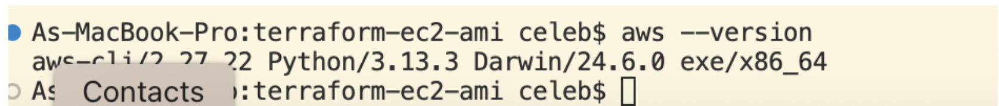
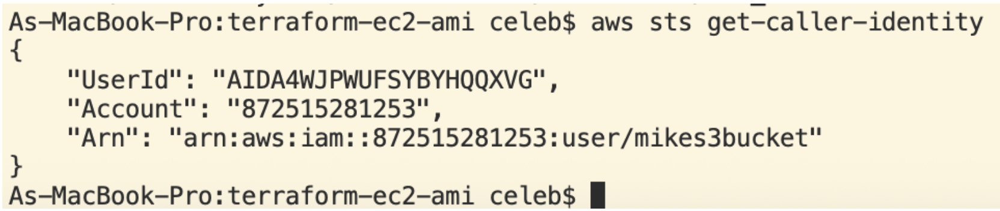
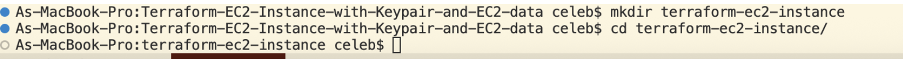
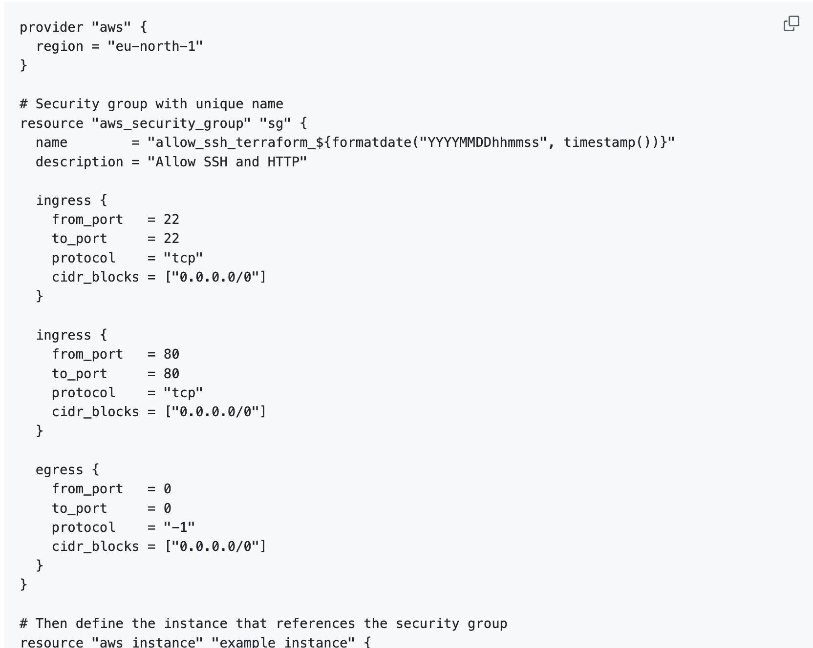
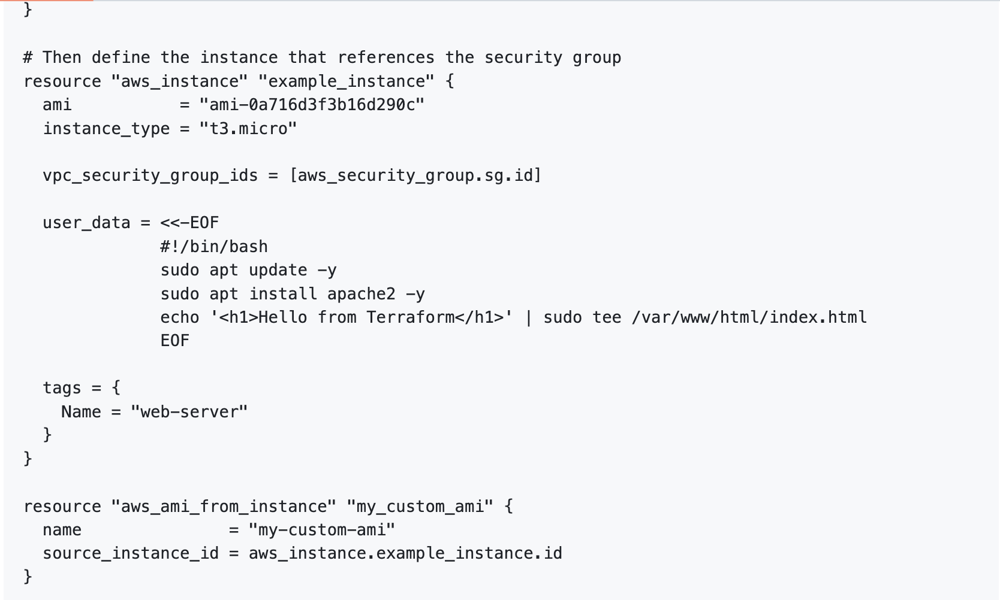
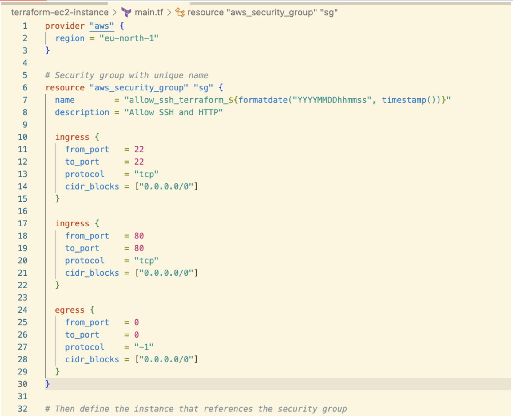
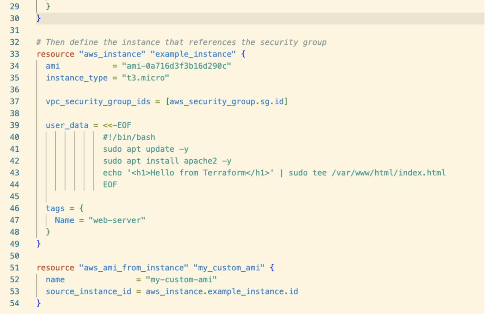
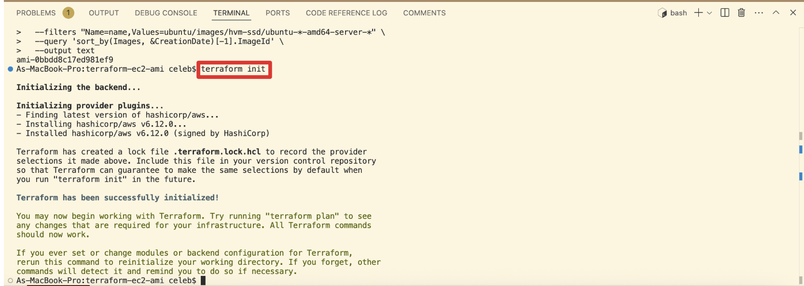
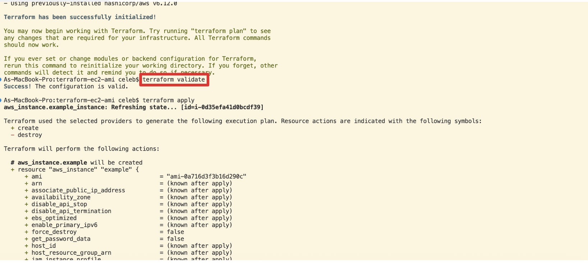

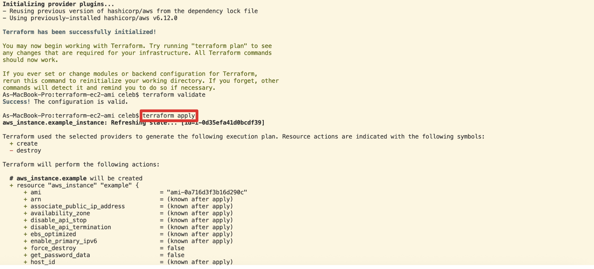
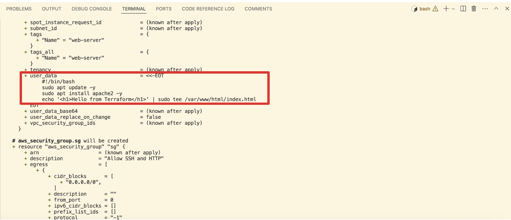
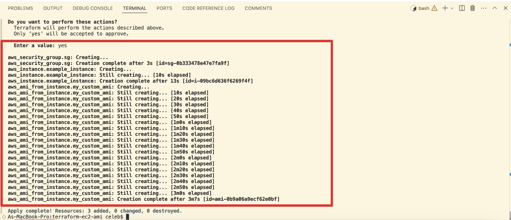
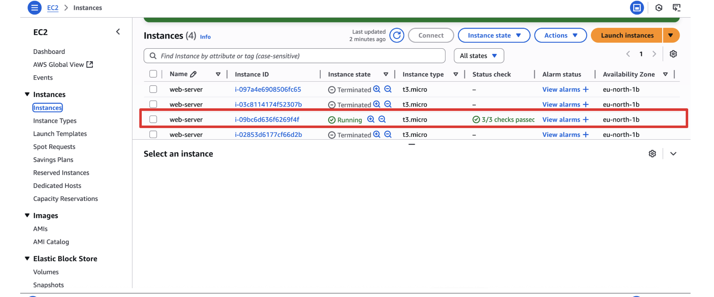
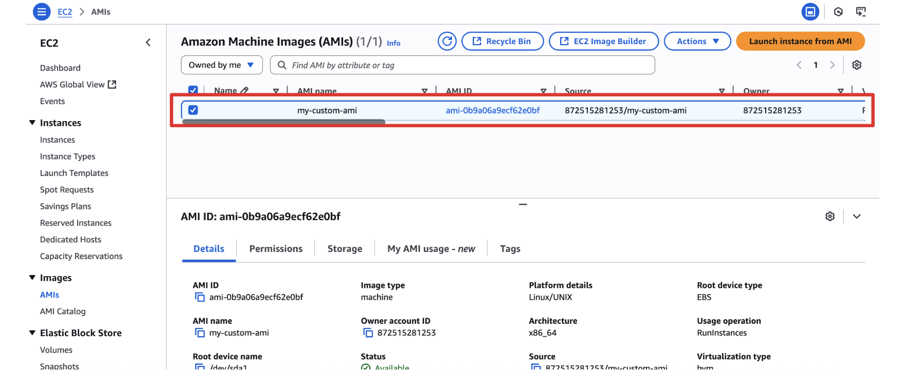
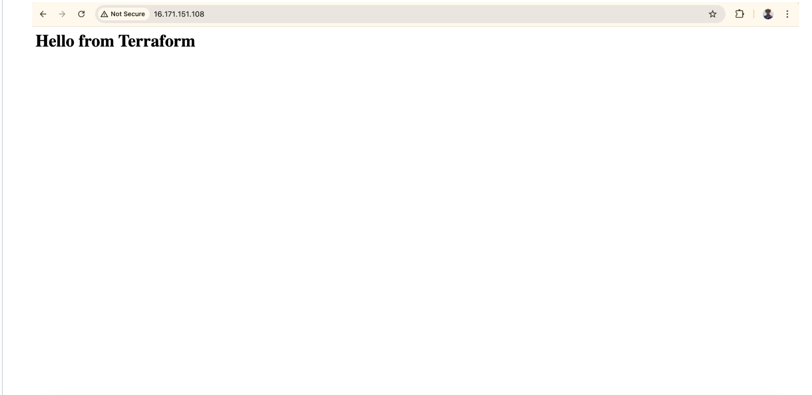
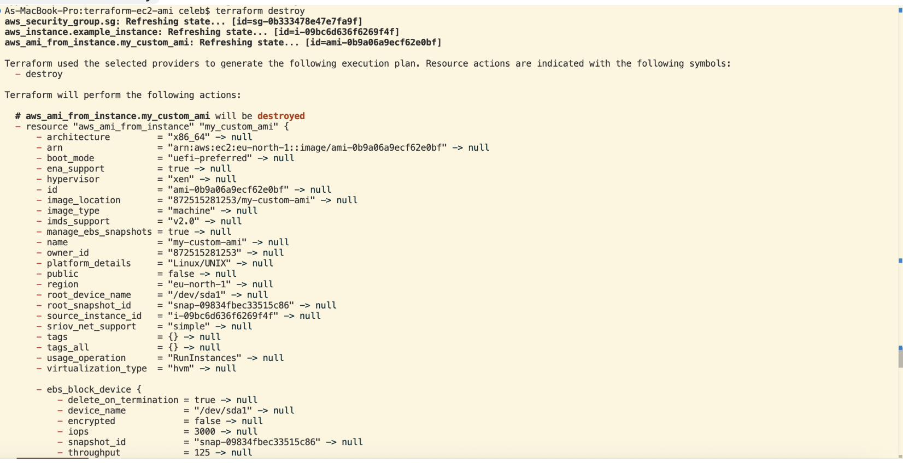
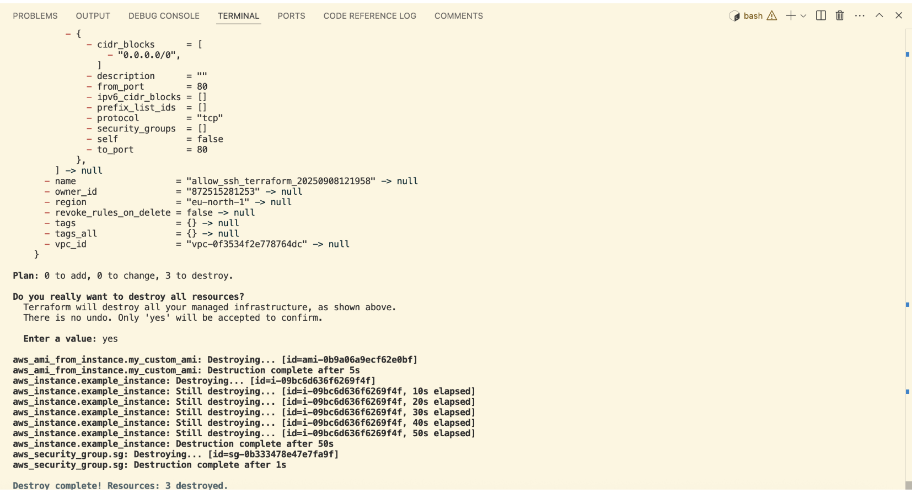

### CONCLUSION
I automated the lifecycle of a tiny public web server with Terraform, from key generation to Apache installation through user data, and verified both HTTP access and SSH connectivity. I preserved clarity for beginners, justified every choice, and captured all relevant failure scenarios with their fixes. The result is a dependable, beginner-friendly stack that I can extend with a custom VPC, remote state, and CI whenever I’m ready.